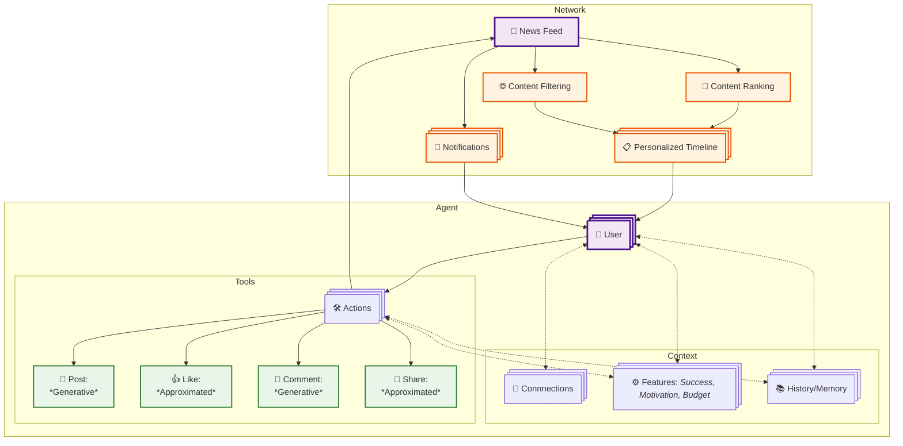
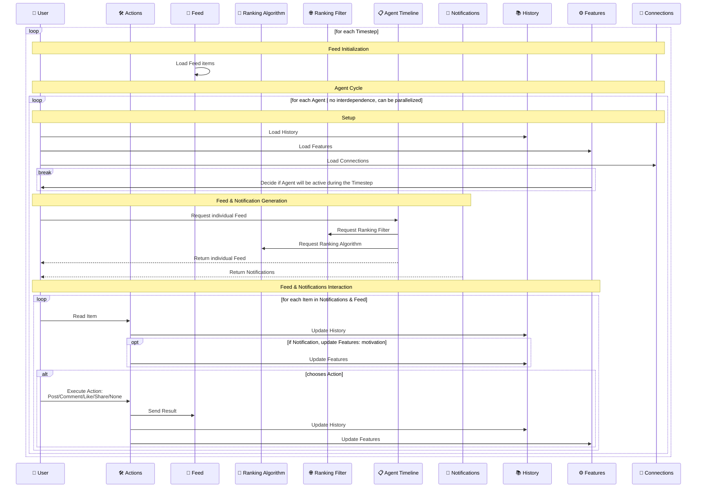

# Feature/Interaction Pattern 

```mermaid
flowchart TB

    subgraph "Network"
        
        FEED[📱 News Feed]

        ALGO[🤖 Content Ranking]
        FILTER[🌐 Content Filtering]
        
        NOTIFY@{shape: processes, label: "🔔 Notifications"}
        TIMELINE@{shape: processes, label: "📋 Personalized Timeline"}

        FEED --> ALGO & FILTER & NOTIFY
        ALGO & FILTER --> TIMELINE
    end

    subgraph "Agent" 

        USER@{shape: processes, label: "👤 User"}

        subgraph "Context"
            CONNECTIONS@{shape: processes, label: "👥 Connnections"}
            FEATURES@{shape: processes, label: "⚙️ Features: *Success, Motivation, Budget*"}
            HISTORY@{shape: processes, label: "📚 History/Memory"}
        end

        subgraph "Tools"
            ACTION@{shape: processes, label: "🛠️ Actions"}
            POST[📝 Post:<br>*Generative*]
            LIKE[👍 Like:<br>*Approximated*]
            COMMENT[💬 Comment:<br>*Generative*]
            SHARE[🔄 Share:<br>*Approximated*]
        end 
        
        ACTION --> POST & LIKE & COMMENT & SHARE
        USER --> ACTION
        USER & ACTION <-.-> HISTORY & FEATURES
        USER <-.-> CONNECTIONS
    end
    
    TIMELINE --> USER
    NOTIFY --> USER
    ACTION --> FEED
    %% USER --> FILTER
    
    %% Styling
    classDef ComponentClass fill:#f3e5f5,stroke:#4a148c,stroke-width:3px
    classDef actionClass fill:#e8f5e8,stroke:#2e7d32,stroke-width:2px
    classDef systemClass fill:#fff3e0,stroke:#e65100,stroke-width:2px
    
    class FEED,USER ComponentClass
    class POST,LIKE,COMMENT,SHARE actionClass
    class ALGO,FILTER,NOTIFY,TIMELINE systemClass
```

```mermaid
sequenceDiagram
    participant U as 👤 User
    participant A as 🛠️ Actions
    participant F as 📱 Feed
    participant AL as 🤖 Ranking Algorithm
    participant FT as 🌐 Ranking Filter
    participant T as 📋 Agent Timeline
    participant N as 🔔 Notifications
    participant H as 📚 History
    participant FE as ⚙️ Features
    participant C as 👥 Connections

    loop for each Timestep
        Note over U,C: Feed Initialization
        F->>F: Load Feed items

        Note over U,C: Agent Cycle
        loop for each Agent | no interdependence, can be parallelized
            Note over U,C: Setup
            U->>H: Load History
            U->>FE: Load Features
            U->>C: Load Connections

            break
                FE->>U: Decide if Agent will be active during the Timestep
            end

            Note over U,N: Feed & Notification Generation
            U->>T: Request individual Feed
            T->>FT: Request Ranking Filter
            T->>AL: Request Ranking Algorithm
            T-->>U: Return individual Feed
            N-->>U: Return Notifications

            Note over U,FE: Feed & Notifications Interaction
            loop for each Item in Notifications & Feed
                U->>A: Read Item
                A->>H: Update History

                opt if Notification, update Features: motivation
                    A->>H: Update Features
                end
                
                alt chooses Action
                    U->>A: Execute Action:<br>Post/Comment/Like/Share/None 
                    A->>F: Send Result
                    A->>H: Update History
                    A->>FE: Update Features
                end
            end
        end
    end
```