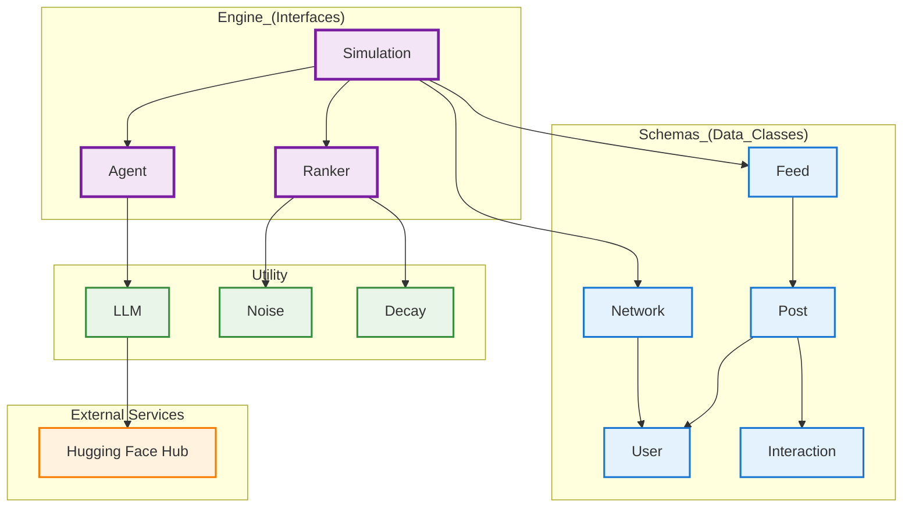
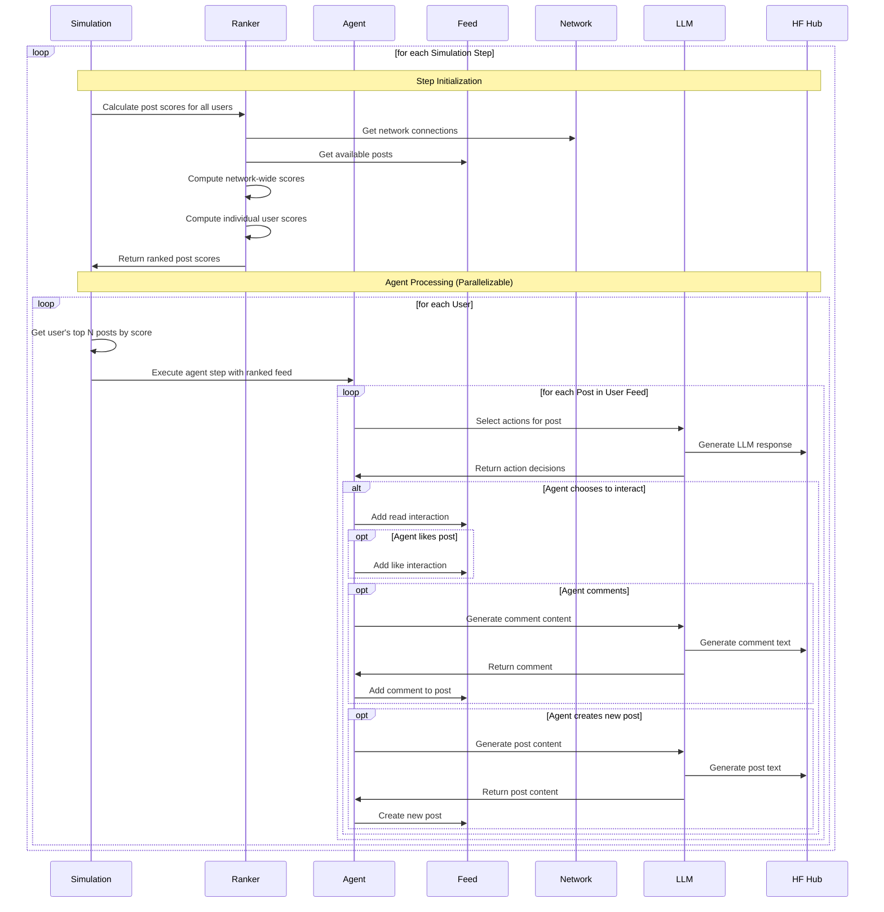

# Feature/Interaction Pattern 

```mermaid
flowchart TB
    subgraph "Schemas_(Data_Classes)"
        USER[User]
        POST[Post]
        FEED[Feed]
        NETWORK[Network]
        INTERACTION[Interaction]
    end
    subgraph "Engine_(Interfaces)"
        SIM[Simulation]
        AGENT[Agent]
        RANKER[Ranker]
    end
    subgraph "Utility"
        LLM[LLM]
        NOISE[Noise]
        DECAY[Decay]
    end
    subgraph "External Services"
        HF[Hugging Face Hub]
    end

    SIM --> AGENT
    SIM --> RANKER
    SIM --> FEED
    SIM --> NETWORK
    
    AGENT --> LLM
    RANKER --> DECAY
    RANKER --> NOISE
    
    LLM --> HF
    
    FEED --> POST
    POST --> USER
    POST --> INTERACTION
    NETWORK --> USER

    %% Styling
    classDef schemaClass fill:#e3f2fd,stroke:#1976d2,stroke-width:2px
    classDef engineClass fill:#f3e5f5,stroke:#7b1fa2,stroke-width:3px
    classDef utilityClass fill:#e8f5e8,stroke:#388e3c,stroke-width:2px
    classDef externalClass fill:#fff3e0,stroke:#f57c00,stroke-width:2px
    
    class USER,POST,FEED,NETWORK,INTERACTION schemaClass
    class SIM,AGENT,RANKER engineClass
    class LLM,NOISE,DECAY utilityClass
    class HF externalClass
```

```mermaid
sequenceDiagram
    participant S as Simulation
    participant R as Ranker
    participant A as Agent
    participant F as Feed
    participant N as Network
    participant L as LLM
    participant HF as HF Hub

    loop for each Simulation Step
        Note over S,HF: Step Initialization
        S->>R: Calculate post scores for all users
        R->>N: Get network connections
        R->>F: Get available posts
        R->>R: Compute network-wide scores
        R->>R: Compute individual user scores
        R->>S: Return ranked post scores

        Note over S,HF: Agent Processing (Parallelizable)
        loop for each User
            S->>S: Get user's top N posts by score
            S->>A: Execute agent step with ranked feed
            
            loop for each Post in User Feed
                A->>L: Select actions for post
                L->>HF: Generate LLM response
                L->>A: Return action decisions
                
                alt Agent chooses to interact
                    A->>F: Add read interaction
                    
                    opt Agent likes post
                        A->>F: Add like interaction
                    end
                    
                    opt Agent comments
                        A->>L: Generate comment content
                        L->>HF: Generate comment text
                        L->>A: Return comment
                        A->>F: Add comment to post
                    end
                    
                    opt Agent creates new post
                        A->>L: Generate post content
                        L->>HF: Generate post text
                        L->>A: Return post content
                        A->>F: Create new post
                    end
                end
            end
        end
    end
```