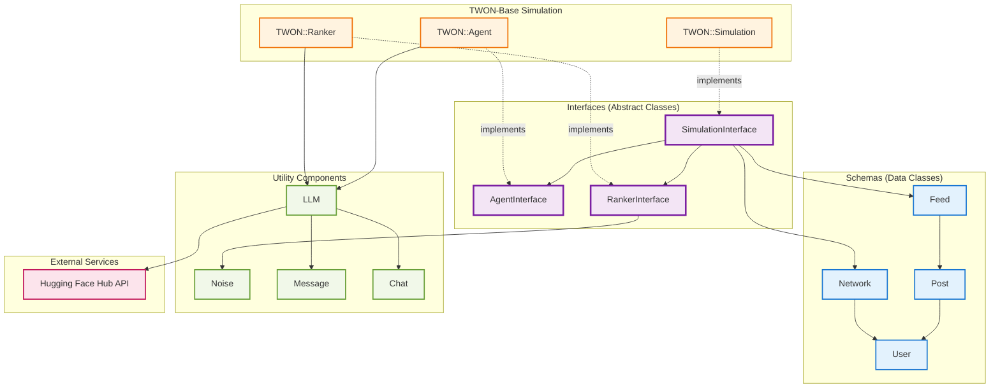
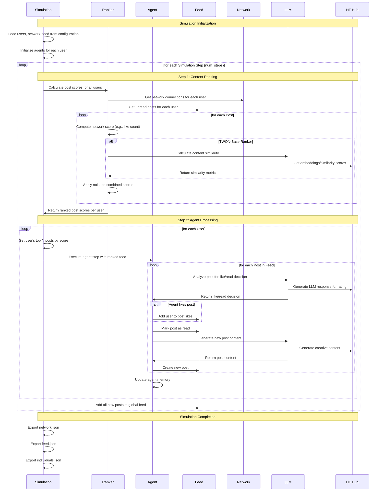

# TWON Base Simulation

```mermaid
flowchart TB
    subgraph "Schemas (Data Classes)"
        USER[User]
        POST[Post]
        FEED[Feed]
        NETWORK[Network]
    end
    
    subgraph "Interfaces (Abstract Classes)"
        SIM[SimulationInterface]
        AGENT[AgentInterface]
        RANKER[RankerInterface]
    end
    
    subgraph "TWON-Base Simulation"
        TWON_SIM[TWON::Simulation]
        TWON_AGENT[TWON::Agent]
        TWON_RANKER[TWON::Ranker]
    end
    
    subgraph "Utility Components"
        LLM[LLM]
        NOISE[Noise]
        MESSAGE[Message]
        CHAT[Chat]
    end
    
    subgraph "External Services"
        HF[Hugging Face Hub API]
    end

    %% Interface relationships
    SIM --> AGENT
    SIM --> RANKER
    SIM --> FEED
    SIM --> NETWORK
    
    TWON_SIM -.->|implements| SIM
    TWON_AGENT -.->|implements| AGENT
    TWON_RANKER -.->|implements| RANKER
    
    %% Utility usage
    TWON_AGENT --> LLM
    TWON_RANKER --> LLM
    RANKER --> NOISE
    
    LLM --> MESSAGE
    LLM --> CHAT
    LLM --> HF
    
    %% Schema relationships
    FEED --> POST
    POST --> USER
    NETWORK --> USER

    %% Styling
    classDef schemaClass fill:#e3f2fd,stroke:#1976d2,stroke-width:2px
    classDef interfaceClass fill:#f3e5f5,stroke:#7b1fa2,stroke-width:3px
    classDef bcmClass fill:#e8f5e8,stroke:#2e7d32,stroke-width:2px
    classDef twonClass fill:#fff3e0,stroke:#ef6c00,stroke-width:2px
    classDef utilityClass fill:#f1f8e9,stroke:#689f38,stroke-width:2px
    classDef externalClass fill:#fce4ec,stroke:#c2185b,stroke-width:2px
    
    class USER,POST,FEED,NETWORK schemaClass
    class SIM,AGENT,RANKER interfaceClass
    class BCM_SIM,BCM_AGENT,BCM_RANKER bcmClass
    class TWON_SIM,TWON_AGENT,TWON_RANKER twonClass
    class LLM,NOISE,MESSAGE,CHAT utilityClass
    class HF externalClass
```

```mermaid
sequenceDiagram
    participant S as Simulation
    participant R as Ranker
    participant A as Agent
    participant F as Feed
    participant N as Network
    participant L as LLM
    participant HF as HF Hub

    Note over S,HF: Simulation Initialization
    S->>S: Load users, network, feed from configuration
    S->>S: Initialize agents for each user

    loop for each Simulation Step (num_steps)
        Note over S,HF: Step 1: Content Ranking
        S->>R: Calculate post scores for all users
        R->>N: Get network connections for each user
        R->>F: Get unread posts for each user
        
        loop for each Post
            R->>R: Compute network score (e.g., like count)
            alt TWON-Base Ranker
                R->>L: Calculate content similarity
                L->>HF: Get embeddings/similarity scores
                L->>R: Return similarity metrics
            end
            R->>R: Apply noise to combined scores
        end
        R->>S: Return ranked post scores per user

        Note over S,HF: Step 2: Agent Processing
        loop for each User
            S->>S: Get user's top N posts by score
            S->>A: Execute agent step with ranked feed
            
            loop for each Post in Feed
                A->>L: Analyze post for like/read decision
                L->>HF: Generate LLM response for rating
                L->>A: Return like/read decision
                
                alt Agent likes post
                    A->>F: Add user to post.likes
                end
                A->>F: Mark post as read
            
            A->>L: Generate new post content
            L->>HF: Generate creative content
            L->>A: Return post content
            A->>F: Create new post
            end
            
            A->>A: Update agent memory
        end
        
        S->>F: Add all new posts to global feed
    end

    Note over S,HF: Simulation Completion
    S->>S: Export network.json
    S->>S: Export feed.json  
    S->>S: Export individuals.json
```